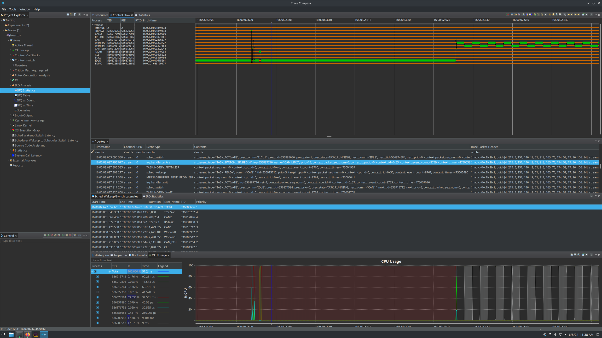

# trace-recorder-to-ctf

Convert FreeRTOS [trace recorder](https://github.com/percepio/TraceRecorderSource) traces to LTTng-shaped [CTF](https://diamon.org/ctf/v1.8.3/).



## Getting Started

1. Collect streaming protocol trace recorder data from your device (i.e. using the RTT or TCP stream port)
1. Install `trace-recorder-to-ctf` from github Releases or build from source (`cargo install --path .`)
1. Convert to CTF
1. View the trace data in [Trace Compass](https://eclipse.dev/tracecompass/) or with [babeltrace2](https://babeltrace.org/)

```bash
trace-recorder-to-ctf trc.psf

# Default output directory is ./ctf_trace
tree ctf_trace/
ctf_trace/
├── metadata
└── stream
```

```
# Inspect the metadata
babeltrace2 ./ctf_trace --output-format=ctf-metadata

babeltrace2 --clock-seconds ./ctf_trace
```

```text
[0.000231544] (+?.?????????) trace-recorder TRACE_START: { cpu_id = 0 }, { id = 0x1, event_count = 6, timer = 41678 }, { task_handle = 2, task = "(startup)" }
[0.000237850] (+0.000006306) trace-recorder OBJECT_NAME: { cpu_id = 0 }, { id = 0x3, event_count = 7, timer = 42813 }
[0.000245077] (+0.000007227) trace-recorder OBJECT_NAME: { cpu_id = 0 }, { id = 0x3, event_count = 8, timer = 44114 }
[0.000252305] (+0.000007228) trace-recorder OBJECT_NAME: { cpu_id = 0 }, { id = 0x3, event_count = 9, timer = 45415 }
[0.000260338] (+0.000008033) trace-recorder MEMORY_ALLOC: { cpu_id = 0 }, { id = 0x38, event_count = 10, timer = 46861 }
[0.000269688] (+0.000009350) trace-recorder QUEUE_CREATE: { cpu_id = 0 }, { id = 0x11, event_count = 11, timer = 48544 }
[0.000280583] (+0.000010895) trace-recorder OBJECT_NAME: { cpu_id = 0 }, { id = 0x3, event_count = 12, timer = 50505 }
[0.000291166] (+0.000010583) trace-recorder OBJECT_NAME: { cpu_id = 0 }, { id = 0x3, event_count = 13, timer = 52410 }
[0.000297744] (+0.000006578) trace-recorder UNKNOWN: { cpu_id = 0 }, { id = 0x14, event_count = 14, timer = 53594 }, { type = "TIMER_CREATE" }
[0.000303427] (+0.000005683) trace-recorder QUEUE_SEND: { cpu_id = 0 }, { id = 0x50, event_count = 15, timer = 54617 }
[0.000307061] (+0.000003634) trace-recorder UNKNOWN: { cpu_id = 0 }, { id = 0xA0, event_count = 16, timer = 55271 }, { type = "TIMER_START" }
[0.000319888] (+0.000012827) trace-recorder MEMORY_ALLOC: { cpu_id = 0 }, { id = 0x38, event_count = 17, timer = 57580 }
[0.000328116] (+0.000008228) trace-recorder MEMORY_ALLOC: { cpu_id = 0 }, { id = 0x38, event_count = 18, timer = 59061 }
[0.000336655] (+0.000008539) trace-recorder MESSAGEBUFFER_CREATE: { cpu_id = 0 }, { id = 0x19, event_count = 19, timer = 60598 }
[0.000346344] (+0.000009689) trace-recorder OBJECT_NAME: { cpu_id = 0 }, { id = 0x3, event_count = 20, timer = 62342 }
[0.000355266] (+0.000008922) trace-recorder MEMORY_ALLOC: { cpu_id = 0 }, { id = 0x38, event_count = 21, timer = 63948 }
[0.000362450] (+0.000007184) trace-recorder MEMORY_ALLOC: { cpu_id = 0 }, { id = 0x38, event_count = 22, timer = 65241 }
[0.000389055] (+0.000026605) trace-recorder OBJECT_NAME: { cpu_id = 0 }, { id = 0x3, event_count = 23, timer = 70030 }
[0.000395288] (+0.000006233) trace-recorder TASK_CREATE: { cpu_id = 0 }, { id = 0x10, event_count = 24, timer = 71152 }
[0.000535150] (+0.000139862) trace-recorder sched_wakeup: { cpu_id = 0 }, { id = 0x30, event_count = 25, timer = 96327 }, { src_event_type = "TASK_READY", comm = "CLI", tid = 536904392, prio = 1, target_cpu = 0 }
```

## Docker

You can also use the Docker image `ghcr.io/jonlamb-gh/trace-recorder-to-ctf:latest`:

```bash
mkdir -p /tmp/output

# Volumes:
# * input file test_system.psf at /test_system.psf
# * output directory /tmp/output at /output
docker run -u $(id -u):$(id -g) -it -v /tmp/test_system.psf:/test_system.psf:ro -v /tmp/output:/output:rw ghcr.io/jonlamb-gh/trace-recorder-to-ctf:latest -o /output/test_system /test_system.psf

tree /tmp/output/
/tmp/output/
└── test_system
    ├── metadata
    └── stream
```

## Concept Mapping

The converter produces CTF data that integrates with several of the out-of-box trace-compass LTTng kernel analyses.

It does this by adding well-known metadata environment key/value pairs and mapping a handful of
scheduling and ISR related events.

### Environment Key/Value Pairs

| Key | Value |
| :--- | ---: |
| tracer_name | lttng-modules |
| tracer_major | 2 |
| tracer_minor | 12 |
| tracer_patchlevel | 5 |
| trace_buffering_scheme | global |
| trace_creation_datetime | `<conversion-datetime>` |

Example `metadata` section:
```
env {
    hostname = "trace-recorder";
    domain = "kernel";
    tracer_name = "lttng-modules";
    tracer_major = 2;
    tracer_minor = 12;
    tracer_patchlevel = 5;
    trace_buffering_scheme = "global";
    trc_endianness = "little-endian";
    trc_format_version = 14;
    trc_kernel_version = "KernelVersion([A1, 1A])";
    trc_kernel_port = "FreeRTOS";
    trc_platform_cfg = "FreeRTOS";
    trc_platform_cfg_version = "1.2.0";
    input_file = "trc.psf";
    trace_creation_datetime = "20240609T113144+0000";
    trace_creation_datetime_utc = "2024-06-09 11:31:44.264757838 UTC";
};
```

### Event Types

| Trace Recorder Event | CTF Event |
| :--- | :--- |
| TASK_READY | sched_wakeup |
| TASK_ACTIVATE | sched_switch when starting/resuming from a task<br/>irq_handler_exit when exiting an ISR |  
| TASK_RESUME | sched_switch when starting/resuming from a task<br/>irq_handler_exit when exiting an ISR |  
| TASK_SWITCH_ISR_BEGIN | irq_handler_entry |
| TASK_SWITCH_ISR_RESUME | irq_handler_exit |

## License

See [LICENSE-MIT](LICENSE-MIT) or http://opensource.org/licenses/MIT.
